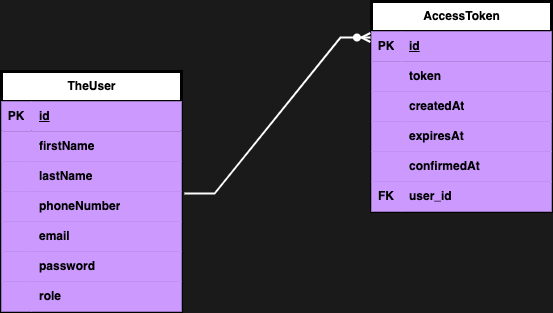

# AuthFortress

AuthFortress is a secure user authentication and authorization system built with Spring Boot and PostgreSQL.

### ENTITY RELATIONSHIP DIAGRAM



## Table of Contents

- [Introduction](#introduction)
- [Features](#features)
- [Prerequisites](#prerequisites)
- [Setup Instructions](#setup-instructions)
- [API Documentation](#api-documentation)
- [Contributing](#contributing)
- [License](#license)
- [Contact](#contact)

## Introduction

AuthFortress provides robust user authentication and authorization capabilities using Spring Security and JWT tokens. It manages user registration, login, account activation via email, and role-based access control.

### FEATURES

**User Authentication and Security**

- User Registration: Allow users to create accounts by providing their names, email, phone number, and password.
- Activate Account using One Time Password (OTP):
   - Send a unique OTP to the user's registered email for account activation.
   - Validate the OTP entered by the user to activate their account securely.
- User Login: Authenticate users with their credentials (email and password) to access the application securely.
- Password Encryption: Encrypt user passwords using bcrypt to enhance security.
- Session Management: Maintain user sessions securely to prevent unauthorized access.

**JWT (JSON Web Token) Integration**

- Token-based Authentication: Generate and validate JWTs to manage user sessions securely across requests.

**Swagger (OpenAPI) Integration**

- API Documentation: Automatically generate API documentation using Swagger for easy API exploration and testing.

**Lombok Integration**

- Reduce Boilerplate Code: Improve code readability and maintainability by reducing boilerplate code with Lombok annotations.

**JavaMailSender Integration**

- Email Notifications: Send activation emails and notifications to users using JavaMailSender for effective communication.

### Role-based Access Control

- **Role Assignment:** Assign roles (e.g., admin, user) to users to define their permissions within the application.
- **Authorization:** Control access to specific resources based on user roles and permissions.


## Technologies Used

- **Backend:** Java, Spring Boot
- **Database:** PostgreSQL
- **Authentication:** JSON Web Tokens (JWT)
- **Testing:** JUnit, Mockito
- **Authentication:** JWT (JSON Web Token)
- **API Documentation:** Swagger (OpenAPI)
- **Simplified Java Development:** Lombok
- **Email Notifications:** JavaMailSender

## Prerequisites

Before you begin, ensure you have the following installed:

- Java Development Kit (JDK) 8 or higher
- Apache Maven
- PostgreSQL database
- IDE (IntelliJ IDEA, Eclipse, etc.)

## Setup Instructions

1. **Clone the repository:**

   ```bash
   git clone https://github.com/Deraclassic/auth_fortress.git
   cd AuthFortress

2. **Set up PostgreSQL database:**
    - Create a PostgreSQL database and configure the connection in `application.properties`.
3. **Email Setup:**
    - Configure your email settings in `application.properties` for sending verification emails.
   ```properties
   spring.mail.host=smtp.example.com
   spring.mail.port=465
   spring.mail.username=${EMAIL}
   spring.mail.password=${EMAIL_PASSWORD}
   spring.mail.properties.mail.smtp.auth=true
   spring.mail.properties.mail.smtp.starttls.enable=true
     ```
   
    - Configure your EMAIL and EMAIL_PASSWORD in your Environment Variables.
4. **JWT Setup:**
   - Configure your JWT settings in `application.properties`.

     ```properties
     jwt.secret=${SECRET_KEY}
     jwt.expiration=86400000
     ```
     
5. **Build and run the application:**

    - Build the application using Maven:

      ```bash
      mvn clean install
      ```

    - Run the application:

      ```bash
      mvn spring-boot:run
      ```

### TESTING PROCEDURE
Backend Testing: Unit testing was done using frameworks like JUnit and Mockito to ensure proper functionality and error handling.

## API Documentation

For API documentation and endpoints, refer to the Swagger UI available at:

- Local: [http://localhost:8080/swagger-ui.html](http://localhost:8080/swagger-ui.html)

## Contributing

Contributions are welcome! Please fork the repository and submit pull requests to contribute to AuthFortress.

## License

This project is licensed under the MIT License - see the [LICENSE](LICENSE) file for details.

### CONTACT
For any inquiries or feedback regarding AuthFortress, please contact me at chiderauzoigwe2@gmail.com.